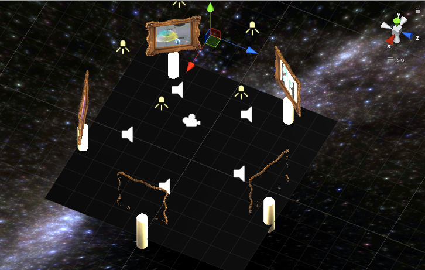
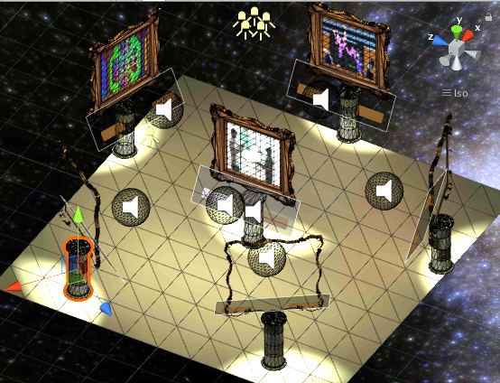

# Night At The Museum Project

## Introduction

Night at the Museum is a gallery of Virtual Reality projects that demonstrate innovative and practical approaches to using virtual reality in educational or analytic tasks. It was constructed as a means to display this research in an interactive environment.

[Here's a video walkthrough](Documentation/museum_demo.mp4)

## Outcomes

- highlights five VR projects
- interactive sound and visuals
- smooth navigation through spaces
- rotating, pulsing skybox sets the ambient otherworldly vibe

## Story of the process

### Research the Projects

This project began by researching and compiling information about several different projects. Project title, organization, url, and a brief description were added to a simple json file with the idea that it could be extended later. The audio asserts were generated programatically using `python` and `espeak` with the idea that it could later be extended by passing the data directly into Unity prefabs.

### Design the Scene

The idea for the scene was to have an equidistantly spaced set of display stations themed like an art gallery. A little scripting and some trigonometry got that working for arbitrary numbers of prefabs in short order.

Once the spacing was set up, I added a starry skybox and some spotlights to highlight the stations.

The frames looked good against the sky but were ignoring the lighting completely.

### Set up the Display and the Lighting

Initially, the lighting wasn't working at all, but after swapping the shaders and making sure the bake settings were configured, lighting effects were visible, but way too hot.

Once they were toned down and angled back, the lights were highlighting the stations nicely.

Similarly, the skybox exposure function intended to enable a slight twinkle initially went from 0.5 to 1.0 and made the stars look way too bright. I toned it down to oscillate at 0.1 to 0.35, which eliminated the galaxy washout effect.

### Add more interactions

To increase the level of interactivity and provide an in-experience citation of the work, I added a credits section. I also added a stop button to let users cut off the audio if they heard it before or decided they were interested in something else. Setting the menu beneath the frame added to the quasi-gallery aesthetic.

### Add More Environment

Finally, in order to increase the atmosphere, I swapped out the flat plane for a mountain prefab which had the nice side-effect of creating some intrigue about a path that weaves through the mountains beyond the gallery of projects.

Here's the flat environment:

Here's the mountain environment:

## User testing outcomes and iteration

I ran two sessions of user feedback and made several changes in response.

The initial testing provided feedback on the basic layout and interaction mechanics.

- its not clear what I'm supposed to do
- viewpoints are way too close to the pictures
- starting point should be in the middle

In response I gave the waypoints some more distance from the stations and added a starting point in the direct center and added some menus describing the project and its audio content.

Another round of testing produced the insights that:

- transition moves too fast
- audio is too loud

I toned down the default audio volumes and added some more details on the menu which seemed to set the stage better. In this round, the rotation speed of the stars was too slow to be noticed and the brightening effect was too strong.

After a third round of testing comments took a much more positive tone:

- is there a way to try those projects from your app?
- oooh, I like the way the stars rotate!
- am I going to be able to walk down that path?

All these are a good sign of an initial positive experience and interest in additional features.

## Conclusion

Night at the Museum provides an interactive look into some exciting VR projects. It encourages the user to explore and interact at their own pace... or to just sit back and watch the stars as they slide slowly past. There's plenty of room to improve with the audio interaction and especially the hopes of some users that they could link directly into the projects highlighted,

----

## Development Version Notes
- Unity 2017.1 / 2017.3.0
- GVR Unity SDK v1.11
- iTween v2.0.7
